# 2021-Olympic-DataEngineering-Project  
## Project Review  
It is an End-to-End Data Engineering project from scratch where I leverage powerful technologies like Azure Data Factory, Azure Data Lake, Databricks, Azure Synapse Analytics, and Apache Spark, following the medallion architecture (Bronze → Silver → Gold layers).
There are different sorts data for ATHLETES, COACHES,GENDERS,MEDALS AND TEAMS from Tokyo Olympic and all are in csv format.  
### The Architecture  
1. **Data Sources**
     - The data source can be accessed from platforms like Kaggle or GitHub (External APIs via HTTP connections), providing datasets for analysis.  
2. **Bronze Layer (Data Ingestion)**
     - Data Ingestion is done using Azure Data Factory.
       - The raw data from the source is ingested into the Bronze Layer.
       - The Raw Data Store is stored in Data Lake Gen 2, which will serve as the staging area for data.
3. **Silver Layer (Transformation)**
     - Data Transformation happens in the Silver Layer using Databricks.  
       - Apache Spark is used for data transformation and processing.  
       - This layer cleans and transforms the raw data from the Bronze Layer, making it ready for further analysis.
4. **Gold Layer (Analytics & Reporting)**
     - The Gold Layer involves advanced analytics using Azure Synapse Analytics.
       - The transformed data from the Silver Layer is used for analytics and dashboard creation.
       - Visualizations are presented in dashboards, providing insights into the data for business or research analysis.
 
This architecture illustrates a streamlined **data pipeline** that takes data from external sources (like Kaggle or GitHub), ingests and transforms it using Azure technologies like **Data Lake** and **Databricks**, and then enables reporting and analytics via **Azure Synapse Analytics**  
### Services  
1. **Data Factory**  
     Data Integration services that enables you to create,schedule, and manage data pipelines for efficient data movement and transformation between various sources & destinations in Azure and beyond. It simplifies ETL and data integration.  
2. **Data Lake Gen2**  
     Data Lake solution that combines the capabilities of a data lake with the power of Azure Blob Storage (store data as a block or entire object), allowing you to store and analyze large volumes of structured and unstructured data with enhanced performance, security, and analytics capabilities.  
3. **Azure Databricks**  
     Databricks is a unified analytical platform built on top of Apache Spark, designed to help data engineers and data scientists collaborate on big data processing, and building machine learning models in a collaborative and scalable environtment.
4. **Synapse Analytics**  
     SQL Data Warehouse, is a cloud based analytics service provided by Microsoft Azure. It combines big data and data warehousing into a single integrated platform, allowing organizations to analyze and process large volumes of data for business intelligence and data analytics purpose.
### Data Flow Summarry & Tech Stack
     API (HTTP) → Azure Data Factory (ADF) → Bronze (Raw Data) → Databricks (Transform) → Silver → Synapse (Serve)
     Azure Data Factory (Ingestion & Orchestration)
     Azure Data Lake (Storage: Bronze, Silver, Gold layers)
     Azure Databricks (Transformation using PySpark)
     Azure Synapse Analytics (Data Warehouse)  
## Phase-I ( Data Loading/Extracting Data to Bronze Layer)  
**All Resources in the Resource Group**  
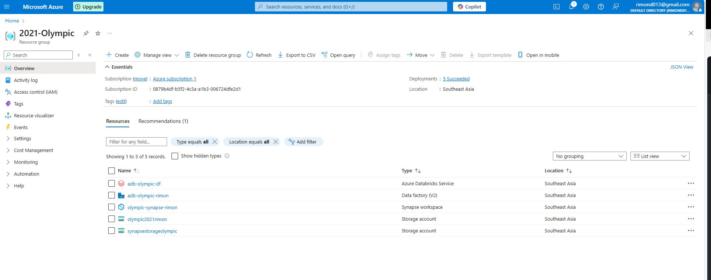    
**All Containers**  
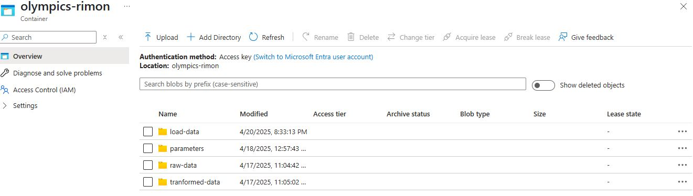  
**Dynamic Pipeline**  
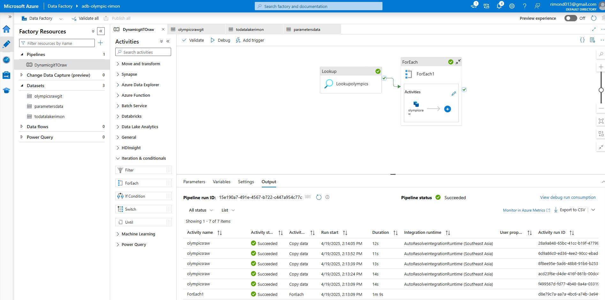 
**Raw Data(SilverLayer)**    
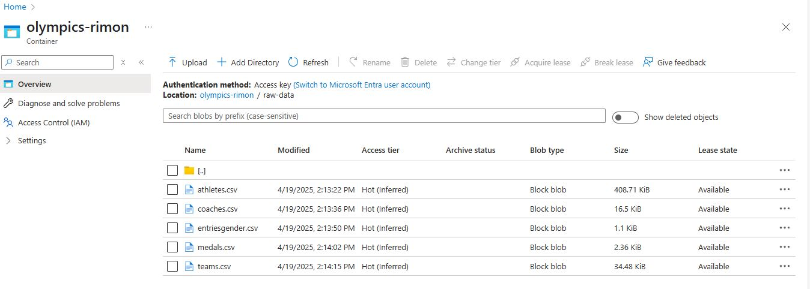 

## Phase-II ( Transforming Data to Silver Layer)  
**Apache Spark Using DataBricks for transforming and processing data**  
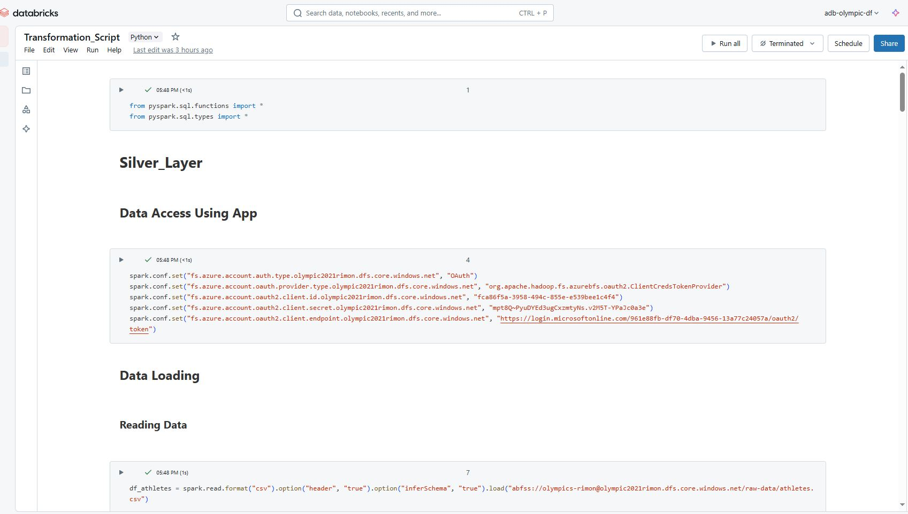 
**Grant IAM Role Permission**  
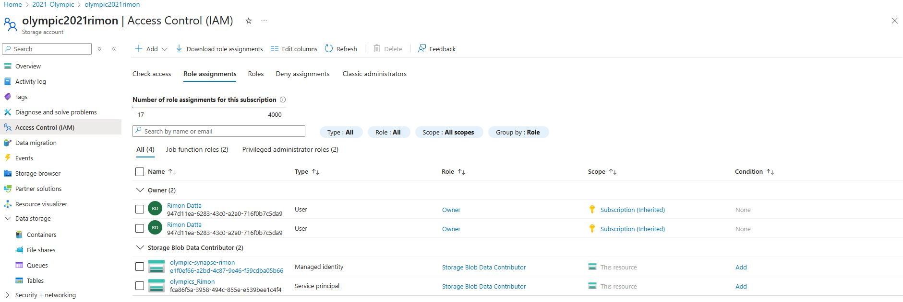 
**Visualizations using DataBricks**  
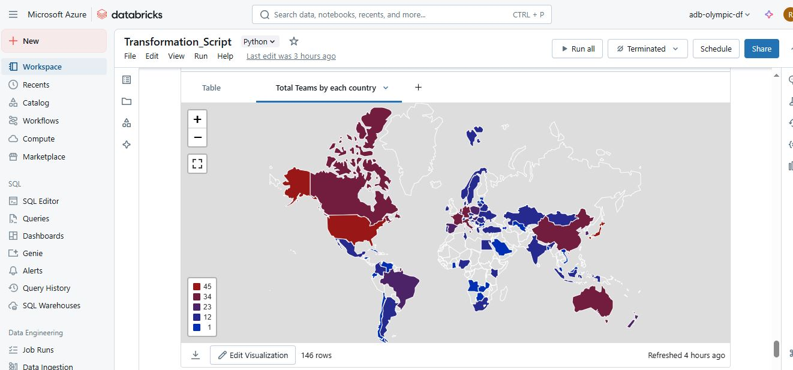 
**Tranformed Data**  
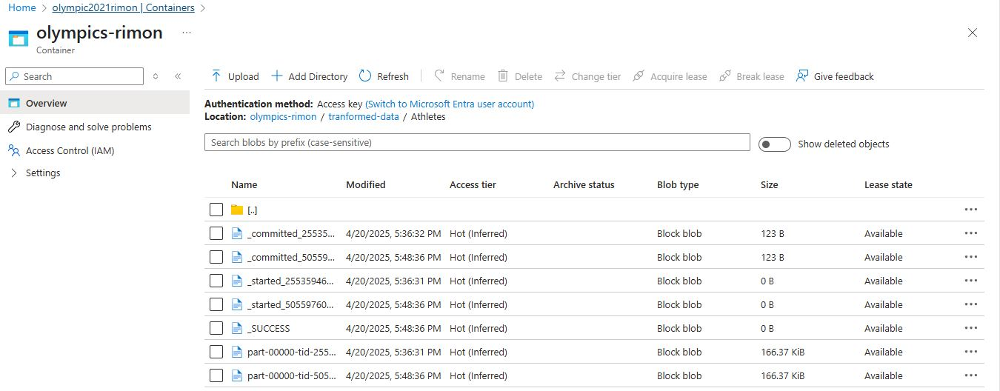 

## Phase-III ( Loading Data to Gold Layer or Serving Layer)  
**Synapse Analytics and Scripts**  
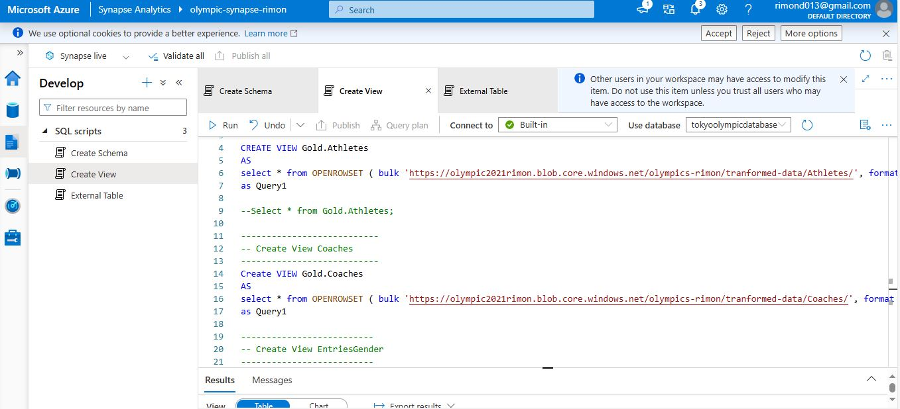  
**External Table**  
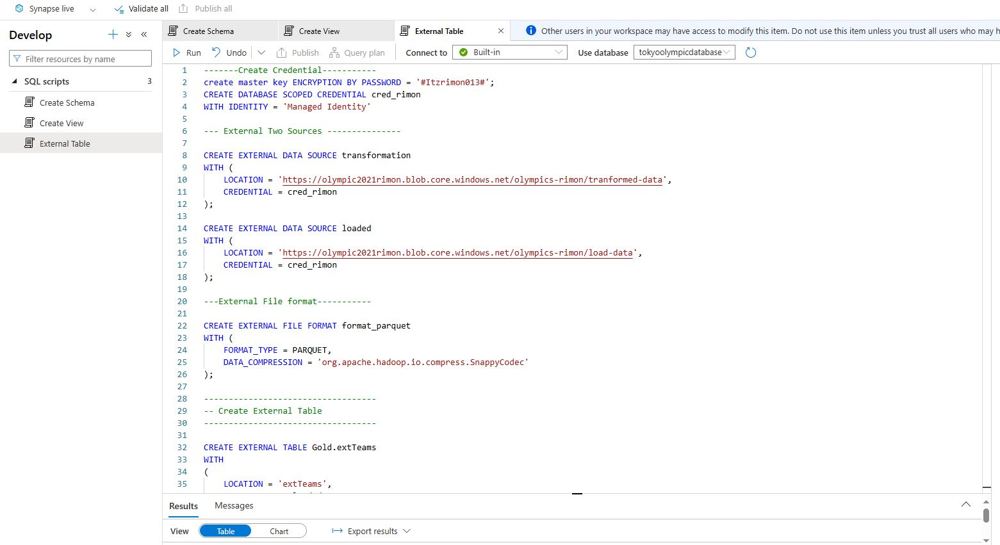  
**Gold Layer Meta Data**
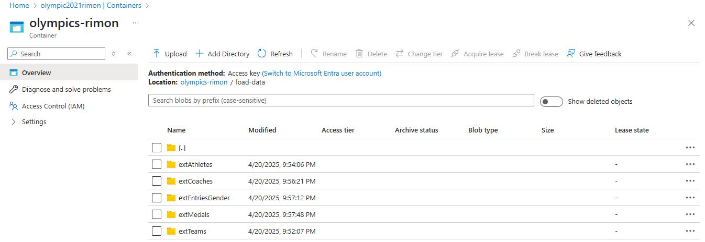 

